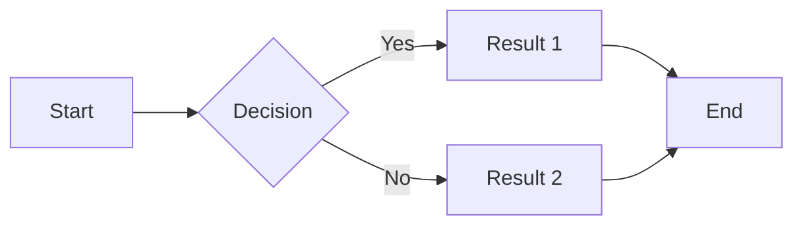
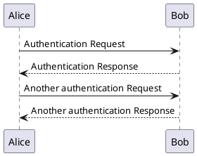
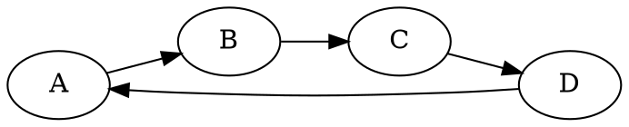

# Diagram Rendering Test

This document tests various diagram types supported by crossnote.

## Mermaid Diagram



## PlantUML Diagram



## WaveDrom Timing Diagram

```wavedrom
{signal: [
  {name: 'clk', wave: 'p.....|...'},
  {name: 'dat', wave: 'x.345x|=.x', data: ['head', 'body', 'tail', 'data']},
  {name: 'req', wave: '0.1..0|1.0'},
  {},
  {name: 'ack', wave: '01..0.|..1'}
]}
```

## GraphViz Diagram



## Vega-Lite Chart

```vega-lite
{
  "$schema": "https://vega.github.io/schema/vega-lite/v5.json",
  "description": "A simple bar chart",
  "data": {
    "values": [
      {"category": "A", "value": 28},
      {"category": "B", "value": 55},
      {"category": "C", "value": 43},
      {"category": "D", "value": 91}
    ]
  },
  "mark": "bar",
  "encoding": {
    "x": {"field": "category", "type": "nominal"},
    "y": {"field": "value", "type": "quantitative"}
  }
}
```

## End of Test

If all diagram types render correctly, you should see visual graphics above, not code blocks.

