# Markdown Rendering Reference Document

This document demonstrates all major markdown features supported by mcp-printer's crossnote renderer. Use this to test rendering quality and verify all features work correctly.

## Text Formatting

**Bold text** and *italic text* and ***bold italic*** work great. You can also use `inline code` and ~~strikethrough~~.

## Lists

**Unordered List:**
- Feature one
- Feature two
  - Nested item
  - Another nested item
- Feature three

**Ordered List:**
1. First step
2. Second step
3. Third step

## Code Block with Syntax Highlighting

```javascript
function fibonacci(n) {
  if (n <= 1) return n;
  return fibonacci(n - 1) + fibonacci(n - 2);
}

const result = fibonacci(10);
console.log(`Fibonacci(10) = ${result}`);
```

```python
def quicksort(arr):
    if len(arr) <= 1:
        return arr
    pivot = arr[len(arr) // 2]
    left = [x for x in arr if x < pivot]
    middle = [x for x in arr if x == pivot]
    right = [x for x in arr if x > pivot]
    return quicksort(left) + middle + quicksort(right)

print(quicksort([3, 6, 8, 10, 1, 2, 1]))
```

## Table

| Feature | Status | Theme |
|---------|--------|-------|
| Mermaid | ✅ Working | Tests diagram colors |
| Syntax | ✅ Working | Tests code colors |
| Tables | ✅ Working | Tests border styling |

## Blockquote

> "The best way to predict the future is to invent it."
> — Alan Kay
>
> This tests blockquote styling and nested content.

## Mermaid Diagrams

### Flowchart

```mermaid
graph LR
    A[Start] --> B{Is Theme Good?}
    B -->|Yes| C[Ship It!]
    B -->|No| D[Adjust Colors]
    D --> B
    C --> E[Success! 🎉]
```


### Sequence Diagram


### Class Diagram


## Emoji Test

Emojis should render: 🎨 📊 ✨ 🚀 ✅ ❌ 💻 📝

## Math Equations (KaTeX)

Inline math: $E = mc^2$

Block math:
$$
\frac{-b \pm \sqrt{b^2 - 4ac}}{2a}
$$

## Quality Checklist

When printing this reference document, verify:

- ✅ **Page numbers** appear at bottom in sans-serif font (e.g., "1 / 2")
- ✅ **Mermaid diagrams** render as visual graphics (not code blocks)
- ✅ **Code blocks** have syntax highlighting
- ✅ **Tables** have clean borders and styling
- ✅ **Math equations** render properly
- ✅ **Sans-serif font** throughout (GitHub-style)
- ✅ **Clean, printer-friendly** white background

If all items check out, the markdown renderer is working perfectly! 🎉

