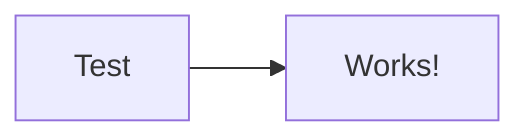

# Markdown Quick Test

**Quick test document** for rapid development iteration.

## Key Features

- Text formatting: **bold**, *italic*, `code`
- Lists work ✓
- Page numbers at bottom

### Code Block

```javascript
function hello() {
  console.log("Syntax highlighting works!");
}
```

### Mermaid Diagram



### Table

| Feature | Status |
|---------|--------|
| Rendering | ✅ |
| Page Numbers | ✅ |

**Math:** $E = mc^2$

---

**Quick check:** Page numbers in sans-serif? Diagram rendered? ✨

